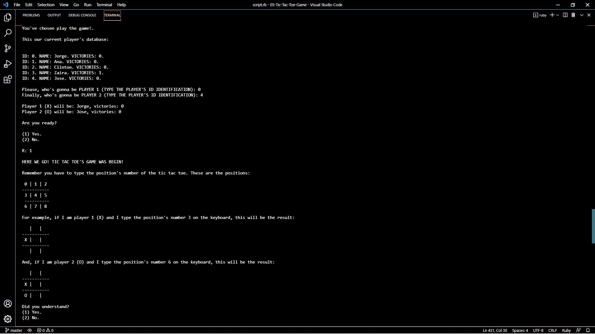
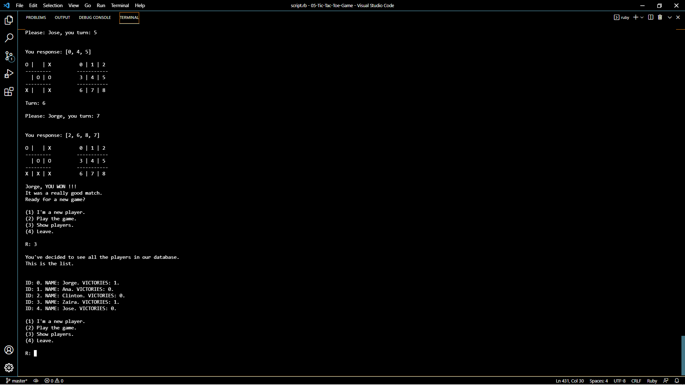

#   PROYECT 11. TIC TAC TOE GAME.  

## Author:
- Jorge Ortiz Mata.
- San Luis Potosí S.L.P. México
- ortiz.mata.jorge@gmail.com
- +52 (444) 576 3034.

## Description: 
        This is the TIC TAC TOE game!
        You will have to introduce the participant's names.
        Remeber, each player will use either X or O.
        Once a player gather three consecutives symbols,
        that player will win. 
        
        Take a look to this project. All the information
        and files are in this repository.
        I hoe you enjoy this project!
        
    Instructions used:
        - Variables.
        - If-Else Statements.
        - While Loops.
        - For Loops.
        - Case expresions.
        - Methods or functions.
        - Clases.
        - Arrays.
    
Have a wonderful day! :smiley:
Greetings :love_you_gesture:
        
## Image. 
### **Program execution.** 

